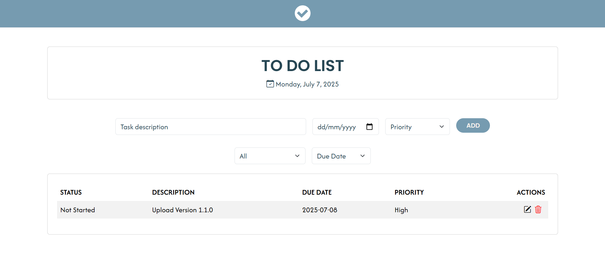

# 📝 To-Do List Web App

A clean, responsive, and easy-to-use web-based To-Do List application designed to help users manage their daily tasks efficiently. Built using **HTML**, **CSS**, **JavaScript**, and **Bootstrap 5**, with data persistence via `localStorage`.

---

## 🔗 Live Preview

✨ You can view the project here: [To-Do List Web App](https://binibiningjenna.github.io/to-do-list/)

---

## 📌 Version

**Current Release: v1.0.0**

This is the first official version of the To-Do List App. It includes basic functionality such as adding, editing, deleting, and filtering tasks with a modern and responsive UI.

---

## ✨ Features

- 🆕 Add new tasks with a description
- ✏️ Edit existing tasks and update their status (`Not Started`, `In Progress`, `Done`)
- 🗑️ Delete tasks with confirmation modal
- 🔍 Filter tasks by status: `All`, `Not Started`, `In Progress`, `Done`
- 📅 Dynamic current date display
- 📭 Message when no tasks are available
- 💾 Tasks are saved using browser `localStorage`
- 📱 Responsive design using Bootstrap
- 🎨 Theming support through CSS variables (ready for dark/light mode)

---

## 📸 Screenshots

---

### 🔧 Built With
- **HTML** 
- **CSS** 
- **JavaScript** 
- **Bootstrap** 

---

## 🧑‍💻 Author
**Jenna Miles Reyes**
IT Student

## 📝 License

This project is licensed under the [MIT License](LICENSE).  